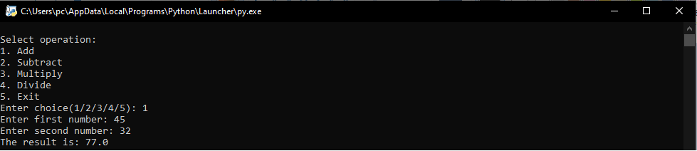
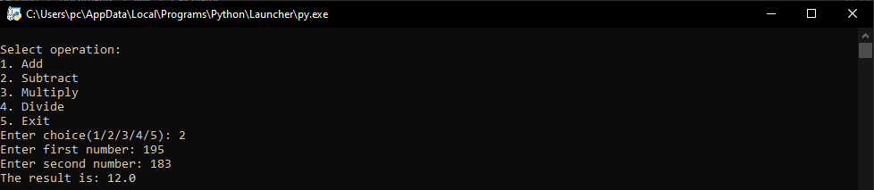
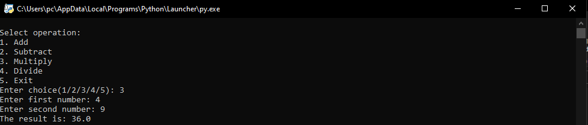
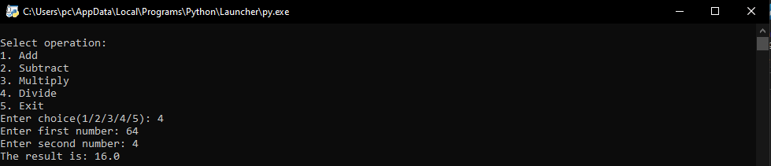
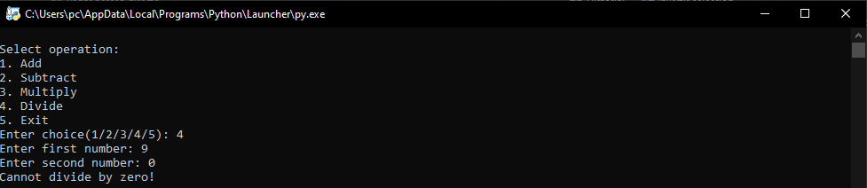

# PYTHON CALCULATOR

This is a simple command-line calculator implemented in Python using Object-Oriented Programming (OOP). The calculator supports basic arithmetic operations such as addition, subtraction, multiplication, and division. It also allows users to perform multiple calculations in one session.

## Features

- Addition: Adds two numbers.
- Subtraction: Subtracts the second number from the first number.
- Multiplication: Multiplies two numbers.
- Division: Divides the first number by the second number (with error handling for division by zero).
- Continuous Operations: The calculator stays active after each calculation, allowing for multiple operations until the user decides to exit.

## Requirements

- Python 3.x
## How to Run

- Clone the repository or download the Python script (calculator.py) to your local machine.
- Ensure you have Python 3 installed. You can check your Python version by running:

    python --version

- Open a terminal or command prompt.
- Navigate to the directory where calculator.py is located.
- Run the script using Python:

    python calculator.py

- Follow the on-screen instructions to select operations and input numbers.
## Usage

Once the script is running, you will be prompted to select an operation:

    Select operation:
        1. Add
        2. Subtract
        3. Multiply
        4. Divide
        5. Exit

- Enter the number corresponding to the operation you want to perform.
- Input the numbers when prompted.
- The result of the operation will be displayed.
- After each operation, you can choose another operation or exit by selecting option 5.
## Example

Here is an example section:

    Select operation:
    1. Add
    2. Subtract
    3. Multiply
    4. Divide
    5. Exit
    Enter choice(1/2/3/4/5): 1
    Enter first number: 10
    Enter second number: 5
    The result is: 15.0

## Screenshots

## Error Handling

- If you attempt to divide by zero, the calculator will display an error message and allow you to enter a new operation.
## License

This project is open-source
